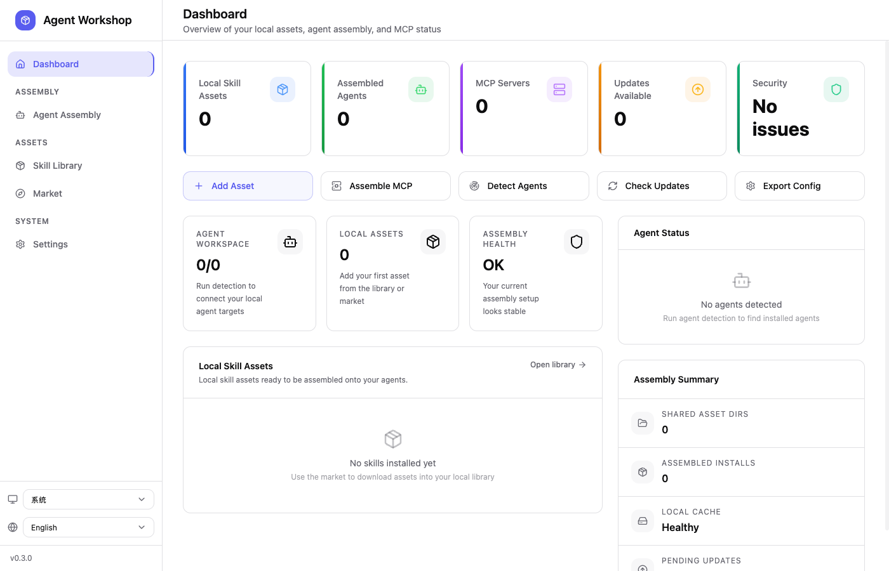
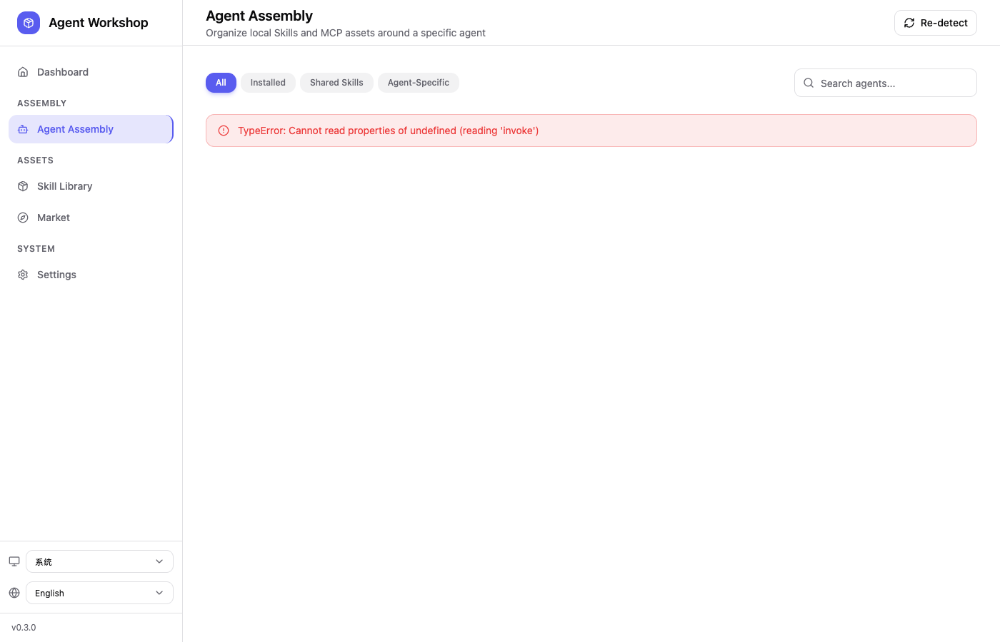
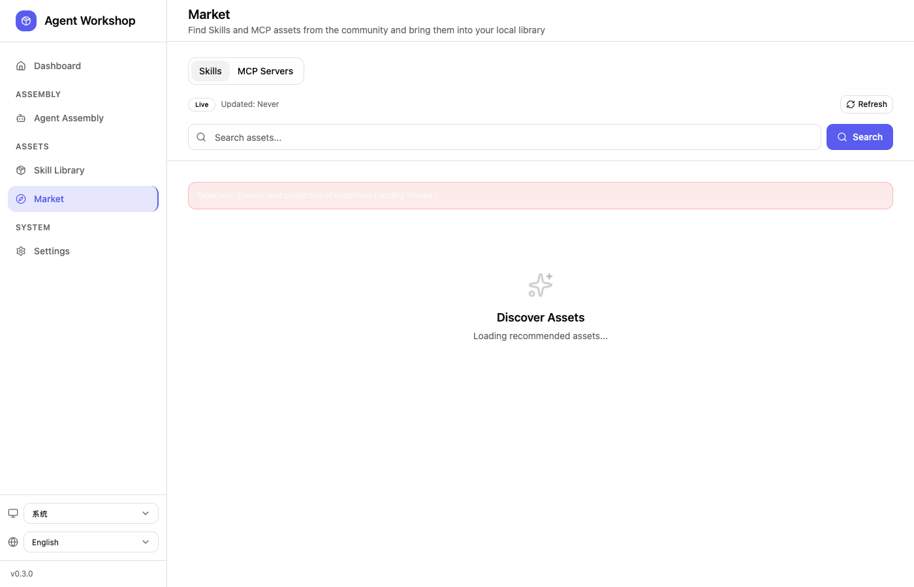
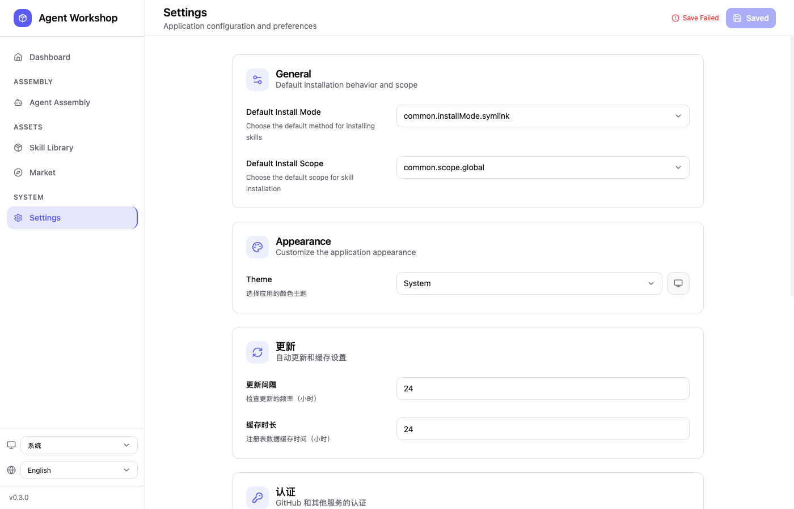

# 🎯 Agent Workshop

<p align="center">
  
</p>

<p align="center">
  <strong>Local-first Desktop Application for Managing AI Agent Skills & MCP Servers</strong>
</p>

<p align="center">
  <a href="#features">Features</a> •
  <a href="#screenshots">Screenshots</a> •
  <a href="#installation">Installation</a> •
  <a href="#development">Development</a> •
  <a href="#documentation">Documentation</a>
</p>

<p align="center">
  
  
  
</p>

---

## ✨ Why Agent Workshop?

Managing AI agent capabilities across different tools shouldn't be a headache. Agent Workshop brings ** Skills** and **MCP Servers** together in one unified interface:

| Problem | Solution |
|---------|----------|
| Different agents use different skill directories and MCP config formats | 🔧 Unified management with 40+ built-in agent adapters |
| Manual file edits get out of sync with tool state | 🔄 Smart detection & re-import from disk |
| Existing tools only handle Skills OR MCP, not both | 🎯 One interface for both capability types |
| Hard to track what's installed where | 📊 Visual overview with filtering & search |

---

## 🚀 Features

### 🧩 Skills Management
- **Install** skills from GitHub, local directories, or URLs
- **Organize** by agent, category, or installation scope
- **Update** with one-click version checks
- **Remove** cleanly with automatic cleanup
- **Import** existing skills from disk with conflict resolution

### 🔌 MCP Server Management
- **Configure** MCP servers per-agent
- **Import** existing MCP configs (Claude, Codex, Gemini, etc.)
- **Sync** configuration changes to agent config files
- **Monitor** connection status

### 🤖 Multi-Agent Support
Built-in support for popular AI agents:

| Agent | Skills Dir | MCP Config |
|-------|-----------|------------|
| Claude Code | `~/.claude/skills` | `~/.claude.json` |
| Codex | `~/.agents/skills` | `~/.codex/config.toml` |
| Gemini CLI | `~/.agents/skills` | `~/.gemini/settings.json` |
| OpenCode | `~/.agents/skills` | `~/.config/opencode/opencode.json` |

---

## 📸 Screenshots

### Dashboard
Get a quick overview of your local assets, installed agents, and system health.

<p align="center">
  
</p>

### Agent Assembly
Organize skills and MCP assets around specific agents. Filter by installation status or skill type.

<p align="center">
  
</p>

### Market
Discover new skills and MCP servers from the community.

<p align="center">
  
</p>

### Settings
Configure application preferences, GitHub authentication, and network settings.

<p align="center">
  
</p>

---

## 📦 Installation

### Prerequisites

- **Node.js** 20+
- **pnpm**
- **Rust** / **cargo**
- **Xcode Command Line Tools** (macOS)

### Quick Start

```bash
# Clone the repository
git clone <repository-url>
cd skills_hub

# Install dependencies
make install

# Start development server
make dev
```

### Build Desktop App

```bash
# Build for production
make build

# Output location (macOS)
# apps/desktop/src-tauri/target/release/bundle/dmg/
```

---

## 🛠️ Development

### Project Structure

```
skills_hub/
├── apps/
│   └── desktop/              # Tauri desktop application
│       ├── src/              # React frontend
│       │   ├── components/   # UI components
│       │   ├── pages/        # Route pages
│       │   ├── stores/       # Zustand state management
│       │   └── lib/          # Utilities & helpers
│       └── src-tauri/        # Rust backend
│           ├── src/          # Rust source
│           │   ├── commands/ # Tauri commands
│           │   ├── services/ # Business logic
│           │   └── agent/    # Agent detection & registry
│           └── Cargo.toml
├── packages/
│   └── core/                 # Shared types & contracts
├── skills-docs/              # Documentation
├── screenshots/              # Application screenshots
├── Makefile                  # Development commands
└── README.md
```

### Tech Stack

| Layer | Technology |
|-------|-----------|
| Desktop Shell | Tauri 2 |
| Frontend | React 18, TypeScript 5, Vite 5 |
| Styling | Tailwind CSS |
| State Management | Zustand |
| Backend | Rust 2021, Tokio, Serde |
| Package Manager | pnpm workspace |

### Common Commands

```bash
make help          # Show all available commands
make install       # Install all dependencies
make dev           # Start desktop development
make check         # Run type checking & linting
make build         # Build production desktop app
make clean         # Clean build artifacts
make test          # Run test suite
```

---

## 📚 Documentation

Comprehensive documentation is available in [`skills-docs/`](./skills-docs/):

1. [Project Overview](./skills-docs/00-overview/PROJECT-OVERVIEW.md) - Architecture & design principles
2. [Development Guide](./skills-docs/05-development/DEV-GUIDE.md) - Contributing & development workflow
3. [System Design](./skills-docs/02-architecture/SYSTEM-DESIGN.md) - Technical architecture
4. [Tauri Commands](./skills-docs/04-api/TAURI-COMMANDS.md) - API reference

---

## 🔧 Supported Agents

Agent Workshop automatically detects and manages:

### Universal Agents (Shared Skills Directory)
- **Codex** - `~/.codex/`
- **Gemini CLI** - `~/.gemini/`
- **OpenCode** - `~/.config/opencode/`

### Agent-Specific
- **Claude Code** - `~/.claude/`
- **OpenClaw** - `~/.openclaw/`

---

## 🌟 Key Concepts

### Skills
Reusable capability packages for AI agents:
- Command templates & workflows
- Tool definitions
- Project scaffolding
- Best practice patterns

### MCP Servers
Model Context Protocol servers for extending agent capabilities:
- External tool integration
- API connectors
- File system access
- Custom capabilities

### Installation Modes
- **Symlink** - Link to original location (default, saves disk space)
- **Copy** - Full copy for isolated environments

### Installation Scope
- **Global** - Available across all projects
- **Project** - Scoped to specific project directory

---

## 🤝 Contributing

We welcome contributions! Areas where help is especially appreciated:

- 🆕 **Agent Support** - Add detection for new AI agents
- 🔄 **Import Strategies** - Improve skill re-import & conflict handling
- 🎨 **UI/UX** - Enhance the interface & user experience
- 📖 **Documentation** - Improve docs & add examples
- 🧪 **Testing** - Increase test coverage
- 🌐 **Platform Support** - Windows & Linux improvements

See [CONTRIBUTING.md](./CONTRIBUTING.md) for guidelines.

---

## 📄 License

This project is licensed under the MIT License - see the [LICENSE](./LICENSE) file for details.

---

## 🙏 Acknowledgments

- [Tauri](https://tauri.app/) - For the excellent desktop framework
- [React](https://react.dev/) - For the UI library
- [Tailwind CSS](https://tailwindcss.com/) - For styling
- The AI agent community for inspiring this tool

---

<p align="center">
  Made with ❤️ for the AI agent ecosystem
</p>
